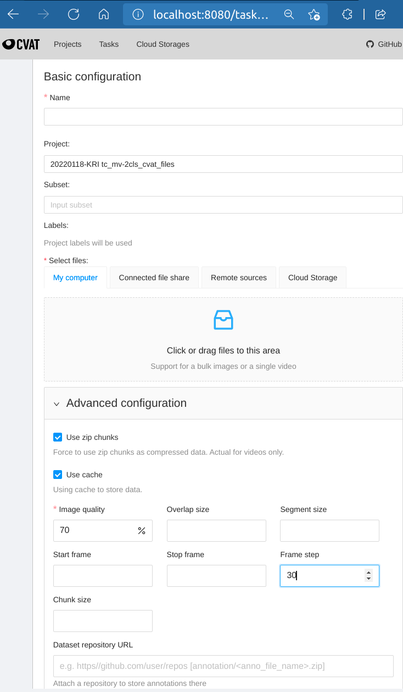

# 1. Set Up [CVAT](https://github.com/openvinotoolkit/cvat)
Just follow the installation files under that github branch

* Version for CLASP v 1.7.0
* Set up Administor account with CVAT docker command
    ```
    docker exec -it cvat bash -ic 'python3 ~/manage.py createsuperuser'
    ```

# 2. CVAT Annotation
## 2.1 Log in CVAT system
1. Use latest ***Edge*** or ***Chrome*** for address *localhost:8080*, there should be the log in page for CVAT
2. Log in as superuser
## 2.2 Create Project and Tasks
1. Create Project
    * Tasks in one Project can have the same action labels, so dont need to copy for each new task
2. Create one Task for each video
    * Frame step can be set as fps of the video, so you can annotate 1 fps, saving a lot of time 

    

# 3. Generate .csv file with 1_create_ava_formated_gt.py
This script takes **a CVAT Project annotation file** in the **CVAT csv video format (version 1.1)** and converts it into a groundtruth file using formatting used by the AVA dataset

** Annotation **coordinates** are **normalized** using **the width and height of the video**  
** Annotation **video_name** is **CVAT task name**   
** Annotation **second** is **CVAT frame step**  
** Annotation default action list: (p2p:1, xfr:2, background:3)  
now touch_move included: (background:1, xfr:2, touch_move:3)

- Print ground truth to screen
```
    python ./1_create_ava_formated_gt.py project_name.xml
```

- Create ground truth file named project_name.csv
```
    python ./1_create_ava_formated_gt.py cam20-p2p-2.xml > ./project_name.csv
```

- Append to ground truth file names project_name.txt 
```bash
    python ./1_create_ava_formated_gt.py project_name.xml >> ./project_name.csv
```

# 6. Split All Annotations into Train and Val sets
For now all annotations are splitted into Train and Val with ratio of 9:1.
```bash
    python ./2_split_train-val.py path-to-annotations-all.csv
```

# (optional) 7. Add False Alarm Samples as Background

# (optional) 8. Remove False Alarm Backgrounds, which are Actions we need
When adding new annotations with new action label, its possible that those annotations are recorded in False Alarms as 'background' label
```bash
    python 4_clean_FA_with_IOU.py /full/path/to/annotations_with_False_Alarms.csv /full/path/to/annotations_with_new_annotations.csv
```
The new annotation file would contain clean combined annotations with all annotations in 2 files without corrupted background ones generated using false alarms.  
The path for the new annotation file would be  ***/full/path/to/annotations_with_False_Alarms-clean.csv***  
*Don't forget to split the annotations to Train and Val sets
